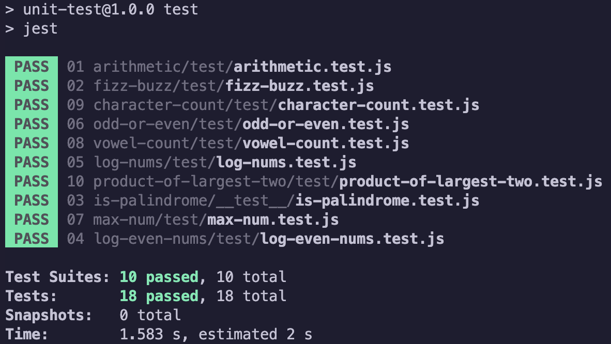

# JavaScript Code Challenges + Jest Testing 
This repository contains a collection of random JavaScript code challenges with Jest test units. The code challenges cover various topics in JavaScript programming, such as arithmetic operations, string manipulation, array manipulation, and more. Each code challenge has a corresponding Jest test unit, allowing developers to test their solutions and check if they meet the desired functionality. This repository is intended for developers who want to practice their JavaScript programming skills and learn how to write test units using Jest.

## TABLE OF CONTENT
1. [Installation](#installation)
1. [Usage](#usage)
1. [Technology](#technology)
1. [More about Jest](JEST.md)
1. [Contact](#contact)

## Installation
1. clone repo to your local machine
1. `npm i`

## Usage 

1. Choose a code challenge from the /unsolved directory.
1. Write your solution in the code challenge /unsolve file.
1. Test your solution:
    * by specific code challenge file, run `npm test <filename.test.js>` in the terminal.
    * by the whole /unsolved file, `cd` into /unsolved file then run `npm test` in the terminal   
1. Check the output of the test to see if your solution meets the desired functionality.
1. Repeat the process for other code challenges to improve your JavaScript programming skills and Jest test unit knowledge.

There are 10 code challenges in total. You will know that you have passed a challenge when a green flag appears.

* NOTE: The /solved directory is available to help you verify your solutions.

---
## Technology
1. [Jest](https://jestjs.io/)
1. JavaScript 

---
## Contact 
Let's stay connected! I welcome your feedback and compliments, so please feel free to drop me a message below.

 